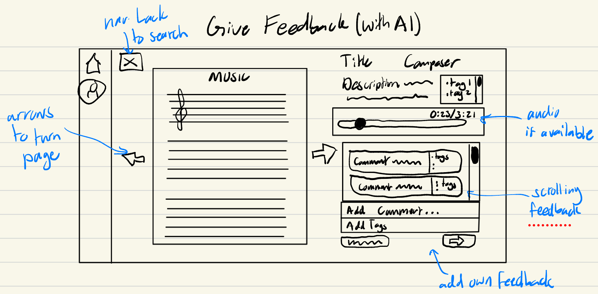
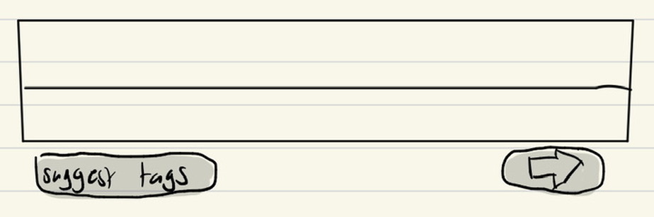
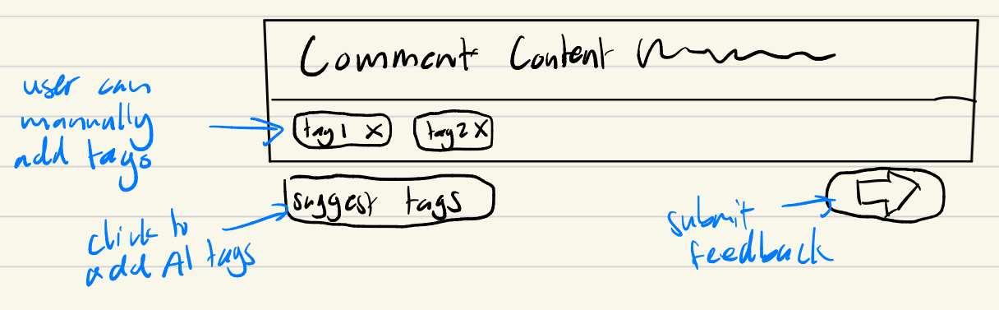
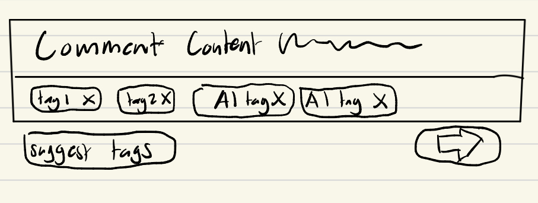
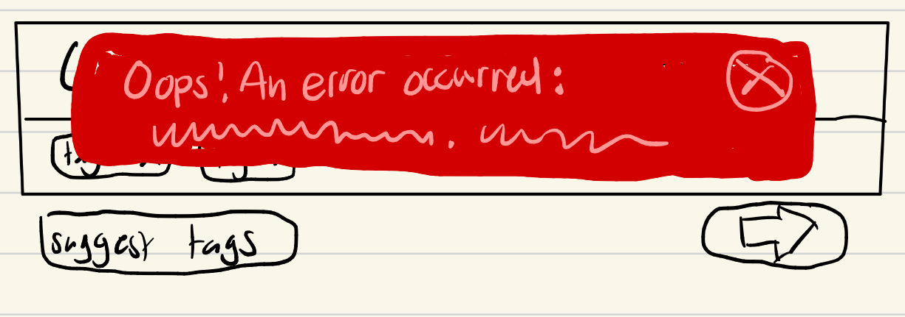

<!-- # DayPlanner
A simple day planner. This implementation focuses on the core concept of organizing activities for a single day with both manual and AI-assisted scheduling.

## Concept: DayPlanner

**Purpose**: Help you organize activities for a single day
**Principle**: You can add activities one at a time, assign them to times, and then observe the completed schedule

### Core State
- **Activities**: Set of activities with title, duration, and optional startTime
- **Assignments**: Set of activity-to-time assignments
- **Time System**: All times in half-hour slots starting at midnight (0 = 12:00 AM, 13 = 6:30 AM)

### Core Actions
- `addActivity(title: string, duration: number): Activity`
- `removeActivity(activity: Activity)`
- `assignActivity(activity: Activity, startTime: number)`
- `unassignActivity(activity: Activity)`
- `requestAssignmentsFromLLM()` - AI-assisted scheduling with hardwired preferences

## Prerequisites

- **Node.js** (version 14 or higher)
- **TypeScript** (will be installed automatically)
- **Google Gemini API Key** (free at [Google AI Studio](https://makersuite.google.com/app/apikey))

## Quick Setup

### 0. Clone the repo locally and navigate to it
```cd intro-gemini-schedule```

### 1. Install Dependencies

```bash
npm install
```

### 2. Add Your API Key

**Why use a template?** The `config.json` file contains your private API key and should never be committed to version control. The template approach lets you:
- Keep the template file in git (safe to share)
- Create your own `config.json` locally (keeps your API key private)
- Easily set up the project on any machine

**Step 1:** Copy the template file:
```bash
cp config.json.template config.json
```

**Step 2:** Edit `config.json` and add your API key:
```json
{
  "apiKey": "YOUR_GEMINI_API_KEY_HERE"
}
```

**To get your API key:**
1. Go to [Google AI Studio](https://makersuite.google.com/app/apikey)
2. Sign in with your Google account
3. Click "Create API Key"
4. Copy the key and paste it into `config.json` (replacing `YOUR_GEMINI_API_KEY_HERE`)

### 3. Run the Application

**Run all test cases:**
```bash
npm start
```

**Run specific test cases:**
```bash
npm run manual    # Manual scheduling only
npm run llm       # LLM-assisted scheduling only
npm run mixed     # Mixed manual + LLM scheduling
```

## File Structure

```
dayplanner/
├── package.json              # Dependencies and scripts
├── tsconfig.json             # TypeScript configuration
├── config.json               # Your Gemini API key
├── dayplanner-types.ts       # Core type definitions
├── dayplanner.ts             # DayPlanner class implementation
├── dayplanner-llm.ts         # LLM integration
├── dayplanner-tests.ts       # Test cases and examples
├── dist/                     # Compiled JavaScript output
└── README.md                 # This file
```

## Test Cases

The application includes three comprehensive test cases:

### 1. Manual Scheduling
Demonstrates adding activities and manually assigning them to time slots:

```typescript
const planner = new DayPlanner();
const breakfast = planner.addActivity('Breakfast', 1); // 30 minutes
planner.assignActivity(breakfast, 14); // 7:00 AM
```

### 2. LLM-Assisted Scheduling
Shows AI-powered scheduling with hardwired preferences:

```typescript
const planner = new DayPlanner();
planner.addActivity('Morning Jog', 2);
planner.addActivity('Math Homework', 4);
await llm.requestAssignmentsFromLLM(planner);
```

### 3. Mixed Scheduling
Combines manual assignments with AI assistance for remaining activities.

## Sample Output

```
📅 Daily Schedule
==================
7:00 AM - Breakfast (30 min)
8:00 AM - Morning Workout (1 hours)
10:00 AM - Study Session (1.5 hours)
1:00 PM - Lunch (30 min)
3:00 PM - Team Meeting (1 hours)
7:00 PM - Dinner (30 min)
9:00 PM - Evening Reading (1 hours)

📋 Unassigned Activities
========================
All activities are assigned!
```

## Key Features

- **Simple State Management**: Activities and assignments stored in memory
- **Flexible Time System**: Half-hour slots from midnight (0-47)
- **Query-Based Display**: Schedule generated on-demand, not stored sorted
- **AI Integration**: Hardwired preferences in LLM prompt (no external hints)
- **Conflict Detection**: Prevents overlapping activities
- **Clean Architecture**: First principles implementation with no legacy code

## LLM Preferences (Hardwired)

The AI uses these built-in preferences:
- Exercise activities: Morning (6:00 AM - 10:00 AM)
- Study/Classes: Focused hours (9:00 AM - 5:00 PM)
- Meals: Regular intervals (breakfast 7-9 AM, lunch 12-1 PM, dinner 6-8 PM)
- Social/Relaxation: Evenings (6:00 PM - 10:00 PM)
- Avoid: Demanding activities after 10:00 PM

## Troubleshooting

### "Could not load config.json"
- Ensure `config.json` exists with your API key
- Check JSON format is correct

### "Error calling Gemini API"
- Verify API key is correct
- Check internet connection
- Ensure API access is enabled in Google AI Studio

### Build Issues
- Use `npm run build` to compile TypeScript
- Check that all dependencies are installed with `npm install`

## Next Steps

Try extending the DayPlanner:
- Add weekly scheduling
- Implement activity categories
- Add location information
- Create a web interface
- Add conflict resolution strategies
- Implement recurring activities

## Resources

- [Google Generative AI Documentation](https://ai.google.dev/docs)
- [TypeScript Documentation](https://www.typescriptlang.org/docs/) -->

# Assignment 3 Tasks

## Augment the design of a concept

### Original TagSearch Concept
**concept** TagSearch[Object]

**purpose** to classify objects with descriptors so they can be easily retrieved later.

**principle** when an object is registered, the user can attach tags to that object. Additional tags can be attached or removed later. They can search for objects that have a specific tag attached and delete objects.

**state**\
&nbsp;&nbsp;a set of Object with\
&nbsp;&nbsp;&nbsp;&nbsp;a tags set of String

**actions**\
&nbsp;&nbsp;register(object: Object, tags: set of String)\
&nbsp;&nbsp;&nbsp;&nbsp;**requires** object is not already registered\
&nbsp;&nbsp;&nbsp;&nbsp;**effects** saves object with tags as its tags set

&nbsp;&nbsp;addTag(object: Object, tag: String)\
&nbsp;&nbsp;&nbsp;&nbsp;**requires** object is registered\
&nbsp;&nbsp;&nbsp;&nbsp;**effects** adds tag to object's tag set

&nbsp;&nbsp;removeTag(object: Object, tag: String)\
&nbsp;&nbsp;&nbsp;&nbsp;**requires** object is registered and has tag in its tag set\
&nbsp;&nbsp;&nbsp;&nbsp;**effects** removes tag from object's tag set

&nbsp;&nbsp;deleteObject(object: Object)\
&nbsp;&nbsp;&nbsp;&nbsp;**requires** object is registered\
&nbsp;&nbsp;&nbsp;&nbsp;**effects** deletes object

&nbsp;&nbsp;matchTags(tags: set of String): (objects: set of Object)\
&nbsp;&nbsp;&nbsp;&nbsp;**requires** true\
&nbsp;&nbsp;&nbsp;&nbsp;**effects** returns the set of Objects that have AT LEAST ALL the passed in tags in their tags set


### AI Augmented Concept Specification

**concept** TagSearch[Resource, GeminiLLM]

**purpose** to classify resources with descriptors so they can be easily retrieved later.

**principle** after an resource is registered, the user can manage tags associated with that resource. They may ask an AI to suggest tags based on the contents of the resource. Tags can be attached or removed later. They can search for resources that have a specific tag attached and delete resources.

**state**\
&nbsp;&nbsp;a set of Registry with\
&nbsp;&nbsp;&nbsp;&nbsp;a Resource\
&nbsp;&nbsp;&nbsp;&nbsp;a description String\
&nbsp;&nbsp;&nbsp;&nbsp;a tags set of String

**actions**\
&nbsp;&nbsp;register(resource: Resource, description: String): (registry: Registry)\
&nbsp;&nbsp;&nbsp;&nbsp;**requires** resource is not already registered to a registry\
&nbsp;&nbsp;&nbsp;&nbsp;**effects** creates and saves a new registry with resource, description, and empty tags set. Returns the registry

&nbsp;&nbsp;addTag(registry: Registry, tag: String)\
&nbsp;&nbsp;&nbsp;&nbsp;**requires** registry exists and doesn't contain tag in its tags set\
&nbsp;&nbsp;&nbsp;&nbsp;**effects** adds tag to registry's tag set

&nbsp;&nbsp;removeTag(registry: Registry, tag: String)\
&nbsp;&nbsp;&nbsp;&nbsp;**requires** registry exists and has tag in its tag set\
&nbsp;&nbsp;&nbsp;&nbsp;**effects** removes tag from registry's tag set

&nbsp;&nbsp;deleteRegistry(registry: Registry)\
&nbsp;&nbsp;&nbsp;&nbsp;**requires** registry exists\
&nbsp;&nbsp;&nbsp;&nbsp;**effects** deletes registry

&nbsp;&nbsp;async suggestTags(registry: Registry, llm: GeminiLLM)\
&nbsp;&nbsp;&nbsp;&nbsp;**requires** registry exists\
&nbsp;&nbsp;&nbsp;&nbsp;**effects** uses llm to create and assign a set of tags that fit the description of the passed in registry's resource. Cannot assign a tag if it is already in registry's tags set

### Note
I wanted to change a lot from my previous design of the concept. The main change (aside from the AI augmentation) is that I made the state a set of "registries" with an resource and tag set under each one. I also changed the actions to work with the new state accordingly. I removed my matchTags action since I think that observer type functions shouldn't be described in the actions. I changed the generic type from object to resource since typescript already seems to have its own Object class.


For the AI augmentation I was mainly thinking of having the AI suggest comment tags based on the content of the comment when a user is giving feedback. These changes are in the principle, state, and actions. For the state I added a "description" field to each registry so that this would be how an LLM gets the context it needs to suggest tags. An LLM-powered action "suggestTags" was added which is the main thing that interacts with the LLM.

## Design the user interaction

The only page that would be affected by this change would be the Feedback Page. Below each figure is a description of its features that are affected by the AI augmentation

### Figure 1


- The full page is shown in Figure 1
- most of its features remain the same from the non AI augmented one
- The main difference is in the bottom right corner, which the next few figures will focus on

### Figure 2


- A zoomed in drawing of the bottom right side of the page without any user input is shown in Figure 2
- The feedback submit button was moved down to give more space to the tags box, which displays any tags currently associated with the user's comment above
- There is now a button under the "tags" box called the suggest button
- The suggest tags and submit button are greyed out indicating that they can not be selected since the user hasn't input anything yet

### Figure 3


- figure 3 shows the bottom right corner with user-given comment and tags
- now the submit and suggest tags button are available to be selected
- note that if the user changes their mind about the tags they've manually input, they may click on the X on it to remove it before posting
- Clicking the suggest tags button sends a prompt to the LLM to get a small handful of tags that it deems relevant to the content of the comment the user typed out above


### Figure 4


- figure 4 shows that the AI added its suggested tags to the tags area
- These suggested tags are automatically added to the "tags" area alongside any tags the user might have previously added
- The user may keep adding tags after getting suggested tags
- Note that any tags can be removed by clicking the X on the tag
- When a user hits the submit button the fields go back to as they were in figure 2 and the user's feedback is posted

### Figure 5


- figure 5 shows what happens if an error comes up while calling the LLM, parsing its response, etc.
- The red box will indicate what the error was in case it requires user action. For example, if their comment resulted in no tags due to the LLM being unable to get any musical ideas out of it
- The red box will stay there until the X on its top right is clicked

### Brief User Journey
Teemo is somewhat new to music composition and goes on Reverb to learn how to give music feedback. Since he plays the piano primarily, he uses the "piano" tag and finds a piano duet composition on the Search page. He clicks on it to navigate to the Feedback page. After reading through it, he notices some awkward notation in the second piano part that makes it hard to read. As a novice composer, he doesn't really know a lot of terminology used when giving others feedback on arrangements. He does his best to describe his thoughts in his comment. However, when it gets to tagging his comment, he doesn't know how to summarize it in a few musical terms as tags. So, Teemo clicks on the "suggest tags" button under the bar. Soon after, three tags appear in his tag box for enharmonics, accidentals, and piano. Teemo can see how the first two tags connect to his comment, but the last tag he feels is redundant seeing as the sheet music only has piano parts. As a result, Teemo clicks on the X for the piano tag to remove it. Satisfied with his comment and two tags, he clicks on the submit arrow to submit his feedback. Teemo is glad that he was able to learn new music terminology and connect it to his comments thanks to the suggested labels.

## Implement your concept
[click here to go to TagSearch implementation](/tagsearch.ts)\
[click her for the first two test cases that test basic functionality](/tagsearch-tests.ts)

I made a pretty basic first draft of a prompt that makes the llm output correctly on simple outputs here:
```
  const criticalRequirements = [
      '1. Each tag must be a single word or a concise phrase (no more than 3 words).',
      '2. Tags should be relevant and specific to the content of the resource such that they summarize it concisely without repeating exactly what is contained.',
      '3. Avoid overly generic tags like "miscellaneous" or "general".',
      '5. Ensure that the tags are appropriate and non-offensive.',
      '6. Tags should have a more positive than negative connotation.',
      '7. Limit the total number of suggested tags to a maximum of four, but you do not need to make exactly four of them.'
  ];
  const resourceDescription = registry.description;
  const prompt =
  `
    You are a helpful AI assistant that creates tags to categorize the contents of resources.
    Given the content of an resource, generate a list of concise, relevant tags that accurately summarize its content.
    resource content may vary, but will typically be related to music. As such, tags that you generate should relate to
    musical composition terminology, genres, moods, themes, instruments, and other music-related concepts.

  You MUST follow these rules when generating tags:
  ${criticalRequirements.join('\n')}

  Your response should be a JSON object, formatted as follows:
  {
      "tags": ["tag1", "tag2", "tag3"]
  }
  where "tags" is an array of strings representing the suggested tags.

  Here is the resource description:
  ${resourceDescription}

  `
```


## Explore richer test cases and prompts


### Outputting too generic tags
A tough issue that I was encountering a lot was that the LLM would output tags that were very surface level and unhelpful for feedback like "music", "music theory", etc. What made this challenging was that I didn't want to make the LLM lose "creativity" while still being focused on what I want it to be focused on. This issue was particularly apparent on descriptions that contained little to no musical terminology for the LLM to work with, which are what I fed into the LLM through the testing function testGenericTags(). To remedy this issue, I:
1. added a line that told the AI it was a professional music teacher to try get it to do some "role prompting"
2. added a line that instructed it to not return un-constructive tags if it can't think of anything helpful to suggest (so it doesn't hallucinate to fill in gaps)
3. removed the text that suggested it to return tags about genres, moods, and themes

The result actually worked out really well. My changes made the LLM return less "unhelpful" tags. It also made it focus more on tags relating to musical composition rather than just music in general. However, it still has an an issue where it will put in more tags than it needs (often tags that mean almost identical things ie. ending and resolution or are not related to the description)

### Illegal output as a result of malicious user behavior
Something that I realized was that the prompt could be "broken into" if the user gives a prompt that says to ignore all past instructions and bake a cake for example. This would result either in illegal output (wrong JSON or just no JSON). In reality, what I would want to happen in these cases is for the LLM to output nothing and sort of ignore the input. I tested this in the testMaliciousInput() test function with a bunch of inputs designed to break the prompt and make the LLM return something bad. This was hard to get fixed, but I ended up:
1. Specified an area of the prompt that contained the user input
2. Specified that this area was not to be looked at for instructions and to ignore anything that tried to give the LLM instructions.
3. Added that the JSON should be the only thing output
4. Added that the LLM should always strive to output 1-4 tags, but that it can output 0 in certain cases
4. Added some examples of when the LLM should output no tags

This ended up making the LLM output nothing for the malicious descriptions I inputted. I think that this was effective, but I am also a bit worried that the LLM might have some false positives where it thinks that a legitimate description would need to be ignored. However, with all the tests I made it didn't seem to do that.

EDIT: after doing the validation section, I made it so that the testMaliciousInput() makes sure that attempting to suggestTags on malicious input throws an error


### Outputting tags that concatenate two ideas
Something that I noticed was that the LLM would try to squeeze in as many ideas as it could into the tags it gave, likely because it operates under the principle that more help is better. This had the effect of making it form two-word tags where the words could have been split into two different tags or maybe even just one of them should have been included. A tag like "major scale" is ok but something like "music theory" should be shortened down to something like "theory" instead. I noticed this erroneous behavior when giving it complex, detailed, and specific descriptions to tag. I tested these complicated inputs in the testTwoWordTags() testing function. I addressed it by doing few-shot prompting:
1. provide a handful of good examples of two-word tags it might output
2. provide a handful of bad examples of two-word tags and what it should output instead
3. specify that short and concise tags are prefered, but two word tags may be used if necessary to preserve the fundamental idea behind them.

As a result, these seem to have decreased the LLM's two-word outputs, which makes the tags more simple and readable. However, it does add a big chunk of tokens to each prompt which might add up in the long run. Additionally, I think it may have restricted the LLM in its creativeness

### Note
My tests/functions were mainly evaluated manually based on console output. However, things like incorrect JSON/LLM output were also programmatically tested to make sure the LLM is outputting in the form I want. In my final submission for this assignment I commented out some of the print statements to improve readability.

## Add validators to your code

There are a few issues that could come up with the LLM that I implemented validators for. The first is that I don't want the LLM to take longer than a couple seconds to return a set of tags. Maybe the comment was just super super long. Whatever the reason, my validation against this issue is by adding a simple timer to the API call (in the gemini llm file) so that if it doesn't give an answer in 5 seconds, I throw an error that says the api call took too long, and the error displayed to the user would mention that their comment is too complex. The second issue that I was worried might come up is the LLM outputting zero tags. Though I do technically allow this in my prompt, if the LLM ends up outputting no tags, that means that there is an issue with the context it was given and the user should be let known of this rather than just nothing being added to the tags set. To address this, I have a simple validation that if the LLM doesn't return any new tags, then it throws an error that explains it couldn't find any tags and the user is notified of this. A third issue that might come up (and that I struggled to remedy a lot in my prompt engineering) is when the LLM returns tags that are themselves too big or empty strings. I want to impose a character limit on tags output by the LLM so that it doesn't hallucinate about musical ideas that don't exist by trying to combine multiple ones. I check this upon recieving the JSON tags. If I get a tag that is too long or empty, I remove it from the list of tags to add. If the tag list becomes empty because of this, then it throws an error.
